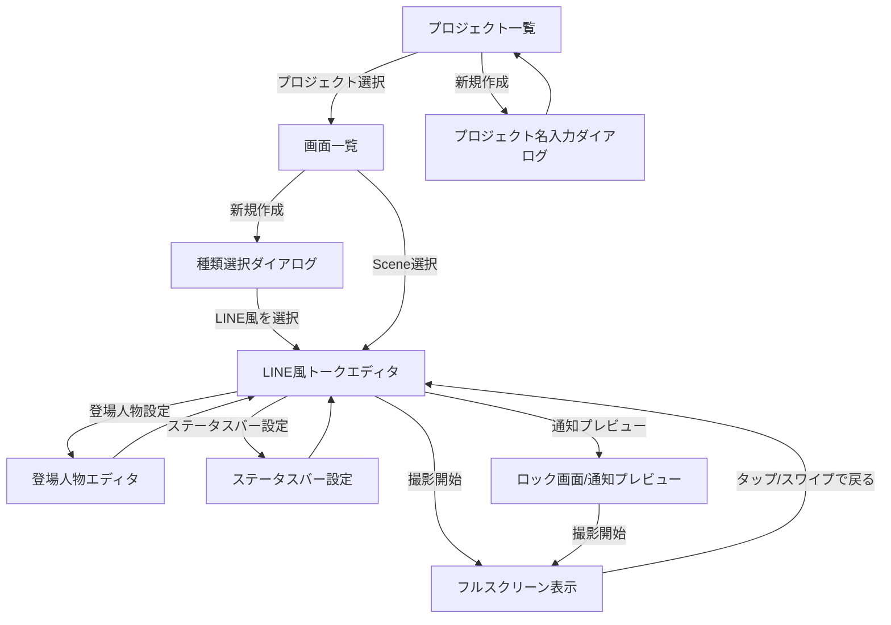
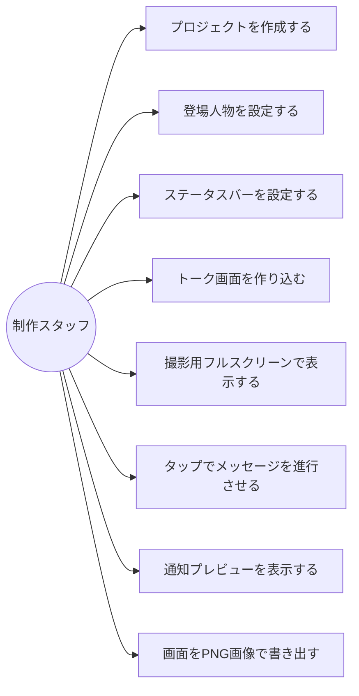

# 機能設計書

> **ステータス:** ドラフト v1.0
> **最終更新:** 2026-06-29

---

## 1. アーキテクチャ概要

### 基本構造：共通インフラ + 種類別エディタ

```
共通インフラ（全スキン共通）
  ├─ プロジェクト管理
  ├─ 登場人物管理
  ├─ ステータスバー設定
  ├─ フルスクリーン表示エンジン
  └─ 画像書き出し

種類別エディタ（スキンごとに個別実装）
  ├─ チャット型エディタ（LINE風トーク）← フェーズ1
  └─ フィード型エディタ（X・Instagram）← フェーズ2以降
```

**テンプレート先行方式：** 新規作成時にまず「何を作るか」を選ばせ、選んだ種類専用の編集画面のみを表示する。ユーザーは常に「自分が選んだ1種類分」の操作だけを見る。

---

## 2. データモデル定義

### ER図

```mermaid
erDiagram
    Project ||--o{ Scene : "1プロジェクトに複数の画面"
    Scene ||--o{ Character : "1画面に複数の登場人物"
    Scene ||--o{ Message : "1画面に複数のメッセージ"
    Scene ||--|| StatusBarConfig : "1画面に1つのステータスバー設定"
    Message }o--|| Character : "メッセージは1人の登場人物が送信"

    Project {
        String id PK
        String name
        DateTime createdAt
        DateTime updatedAt
    }

    Scene {
        String id PK
        String projectId FK
        String name
        SceneType type
        int orderIndex
        DateTime createdAt
    }

    Character {
        String id PK
        String sceneId FK
        String name
        String iconPath
        bool isSelf
        int orderIndex
    }

    Message {
        String id PK
        String sceneId FK
        String characterId FK
        String text
        String displayTime
        bool isRead
        int orderIndex
    }

    StatusBarConfig {
        String sceneId PK_FK
        String customTime
        bool useCurrentTime
        int signalStrength
        int batteryLevel
        bool isCharging
        DeviceType deviceType
    }
```

### 型定義

```
SceneType: enum { chat, feed }
DeviceType: enum { iphone, android }
signalStrength: 0〜4（0=圏外、4=最大）
batteryLevel: 0〜100（%）
```

### データ保存

- 保存先：端末ローカル（Hiveを使用）
- クラウド同期：なし
- アカウント：不要

---

## 3. 画面一覧

| 画面ID | 画面名 | 概要 |
|--------|--------|------|
| S01 | プロジェクト一覧 | プロジェクトの作成・一覧・削除 |
| S02 | 画面一覧 | プロジェクト内のSceneを複数管理 |
| S03 | 種類選択ダイアログ | 新規Scene作成時の種類選択（フェーズ1はLINE風のみ） |
| S04 | LINE風トークエディタ | 吹き出しの作成・編集・並び替え |
| S05 | 登場人物エディタ | 名前・アイコン画像の設定 |
| S06 | ステータスバー設定 | 時刻・電波・電池・デバイス種別の設定 |
| S07 | フルスクリーン表示 | 撮影用。タップで進行操作 |
| S08 | ロック画面/通知プレビュー | 通知風表示画面 |

---

## 4. 画面遷移図



---

## 5. 画面別機能設計

### S01：プロジェクト一覧

**機能：**
- プロジェクトのカード一覧表示（名前・作成日・画面数）
- 新規プロジェクト作成（名前入力ダイアログ）
- プロジェクトの削除（スワイプまたは長押しメニュー）
- タップでS02（画面一覧）へ遷移

**レイアウト：**
```
┌─────────────────────────┐
│  フェイク画面メーカー      │  ← AppBar
│                    [＋] │
├─────────────────────────┤
│ ┌─────────────────────┐ │
│ │ 作品タイトルA        │ │  ← プロジェクトカード
│ │ 画面数：3 | 2026/06  │ │
│ └─────────────────────┘ │
│ ┌─────────────────────┐ │
│ │ 作品タイトルB        │ │
│ │ 画面数：1 | 2026/06  │ │
│ └─────────────────────┘ │
└─────────────────────────┘
```

---

### S02：画面一覧

**機能：**
- Scene のカード一覧表示（名前・種類・サムネイル）
- 新規Scene作成（S03へ）
- Scene の削除
- Scene の名前変更
- タップでS04（エディタ）へ遷移

---

### S04：LINE風トークエディタ

**機能：**
- メッセージ一覧表示（吹き出し形式でプレビュー）
- メッセージの追加（送信者・本文・時刻・既読を入力）
- メッセージの編集・削除
- メッセージの並び替え（ドラッグ）
- 登場人物エディタへのナビゲーション
- ステータスバー設定へのナビゲーション
- フルスクリーン表示モードの起動
- 通知プレビューの起動
- 画像書き出し（現在のプレビュー画面をPNG保存）

**メッセージ追加フォーム：**
```
┌─────────────────────────┐
│ 送信者: [田中 ▼]        │
│ 本文:  [          ]     │
│ 時刻:  [14:30]          │
│ 既読:  [✓] 既読         │
│           [追加] [キャンセル]│
└─────────────────────────┘
```

---

### S05：登場人物エディタ

**機能：**
- 登場人物リスト表示
- 登場人物の追加（名前・アイコン画像・送受信区分）
- 登場人物の編集・削除
- アイコン画像：カメラロールから選択、または色付きイニシャルアバターを自動生成

**制約：**
- 最低2人（送信側isSelf=true が1人、受信側が1人以上）
- isSelf=true は1人のみ

---

### S06：ステータスバー設定

**機能：**
- 時刻設定：任意テキスト入力 または 現在時刻を使用するトグル
- 電波強度：0〜4のスライダーまたはセグメント選択
- 電池残量：数値入力（0〜100）
- 充電中：トグル
- デバイス種別：iPhone / Android の切り替え

**プレビュー：** 設定内容がリアルタイムでステータスバーのプレビューに反映される

---

### S07：フルスクリーン表示

**機能：**
- OS のステータスバー・ホームバー・通知を完全に非表示にする
- アプリ描画のステータスバーで上書き表示
- 初期状態：メッセージをすべて非表示にして待機
- タップ操作：タップするたびに次のメッセージが「届くアニメーション」で表示される
- 長押しまたはスワイプ：エディタに戻る（撮影終了）
- 透かし（ウォーターマーク）：一切表示しない

**フルスクリーン実装：**
- `SystemChrome.setEnabledSystemUIMode(SystemUiMode.immersiveSticky)` を使用
- ステータスバー領域はアプリ側で完全に描画

**メッセージ進行アニメーション：**
- 吹き出しが下からスライドインして表示
- 既読マークは設定値に従い表示

---

### S08：ロック画面/通知プレビュー

**機能：**
- iPhone風・Android風のロック画面を表示
- 最上部のメッセージ（または指定メッセージ）を通知バナー形式で表示
- 通知に表示する情報：アプリ名（「メッセージ」等）・相手名・本文冒頭・時刻
- フルスクリーン表示モードの起動
- 画像書き出し

---

## 6. 共通コンポーネント設計

### ステータスバーウィジェット

フルスクリーン表示・通知プレビュー・エディタプレビューで共用。

```
StatusBarWidget
  ├─ 入力: StatusBarConfig, DeviceType
  ├─ iPhone風: 左=時刻、右=電波・WiFi・電池（ノッチ対応）
  └─ Android風: 左=時刻、右=電波・電池（パンチホール対応）
```

### 吹き出しウィジェット（ChatBubbleWidget）

```
ChatBubbleWidget
  ├─ 入力: Message, Character
  ├─ isSelf=true: 右寄せ・緑背景
  └─ isSelf=false: 左寄せ・白背景 + アイコン表示
```

### アイコンウィジェット（CharacterAvatarWidget）

```
CharacterAvatarWidget
  ├─ iconPath が存在: 画像ファイルを円形表示
  └─ iconPath が null: 名前の頭文字 + カラー背景で自動生成
```

---

## 7. ユースケース図



---

## 8. データフロー

```
ユーザー操作
  │
  ▼
Riverpod（StateNotifier/Provider）
  │  状態更新
  ▼
Hive（ローカルDB）
  │  永続化
  ▼
UI（Flutter Widget ツリー）
  │  再描画
  ▼
ユーザーが画面を確認
```

---

## 9. 画像書き出し機能

- `screenshot` パッケージを使用
- 対象：フルスクリーン表示中のウィジェット全体（ステータスバー含む）
- 出力形式：PNG
- 保存先：カメラロール（`image_gallery_saver` パッケージを使用）
- 権限：iOS は `NSPhotoLibraryAddUsageDescription`、Android は `WRITE_EXTERNAL_STORAGE`（API 28以下）が必要

---

## 10. フェーズ2以降の拡張ポイント

| 拡張項目 | 設計上の対応 |
|----------|-------------|
| 着信・通話画面 | `SceneType` に `incoming` / `call` を追加 |
| SNSフィード型 | `SceneType.feed` を追加し、フィード型エディタを別実装 |
| AIチャット型 | `SceneType.ai` を追加し、専用エディタを実装 |
| 買い切り課金 | RevenueCat 等を共通インフラに組み込む |
